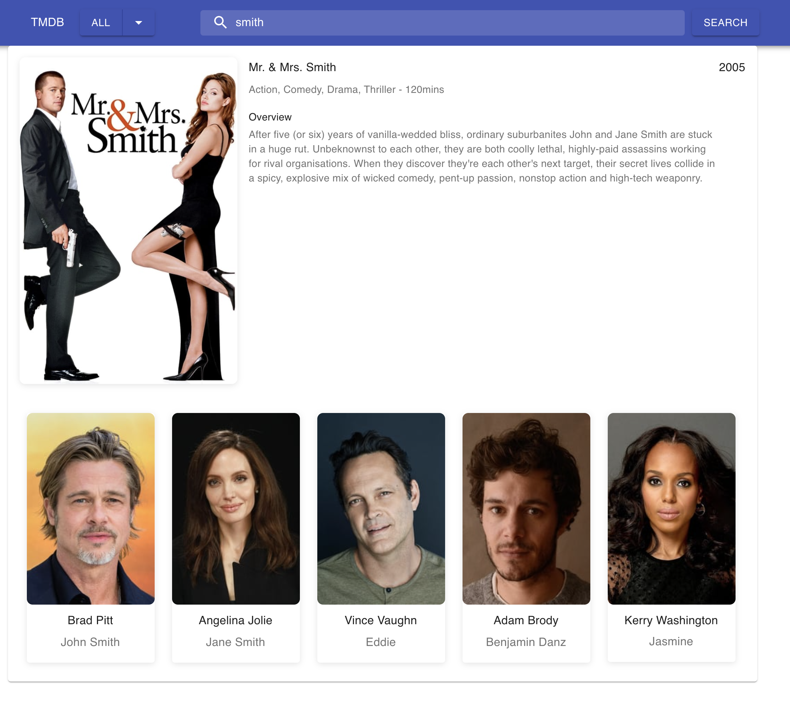
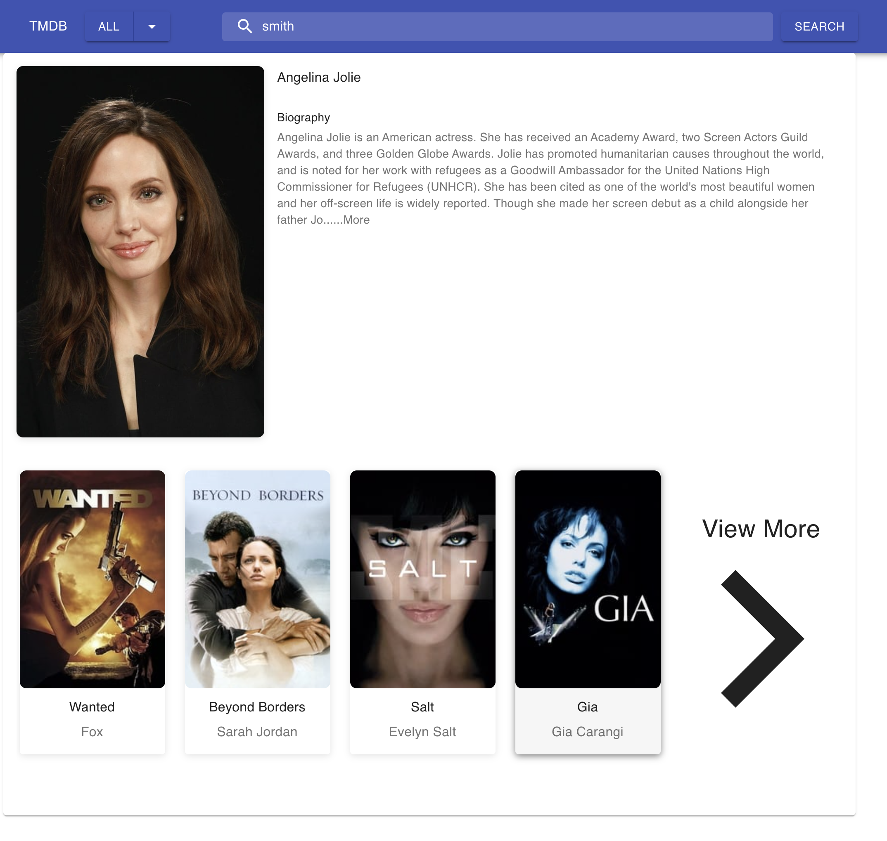

### TMDB Project

About The Project
This TMDB app created with Create React App, JavaScript, ReactJS HOOKS, Redux, Material UI and The Movie Database (TMDb) API. Create a movie search application that allows a user to search for a movie, tv show or actor and be
presented with a list of search results. Use the TMDB API to source your data.

[Project live link](https://tmdb-project-git-master-harunkisacuk.vercel.app/)

## Contributing

Contributions, issues and feature requests are welcome! Start by:

- git clone https://github.com/harunkisacuk/TMDB-project
- Change directory with cd TMDB-project,
- Run yarn to install dependencies
- yarn start
- runs the "app" in dev mode. Open http://localhost:3000 to view it in your browser.
- I deployed to vercel https://tmdb-project-git-master-harunkisacuk.vercel.app/

yarn test

Launches the test runner in interactive watch mode.
Unfortunately jest has idiosyncracies re. coverage if nothing test-wise has changed between commits: you'll need to run yarn test --coverage --watchAll=false to see 100% code coverage in the terminal.
yarn test --coverage will still generate a coverage report in the project's root directory: coverage/lcov-report (reveal in finder to open coverage index.html files)

### Built With

This project was built using these technologies.

- Javascript
- ReactJS Hooks
- Redux
- Styled Component
- HTML/CSS
- Atomic Design Pattern
- Axios
- Immer
- Material UI
- Jest
- React Testing Library

​Harun Kisac

- Github: [@harunkisacuk](https://github.com/aaronkisac)
- Linkedin: [Aaron Kisac](https://www.linkedin.com/in/aaron-kisac/)
- E-mail: harunk3uk@gmail.com
